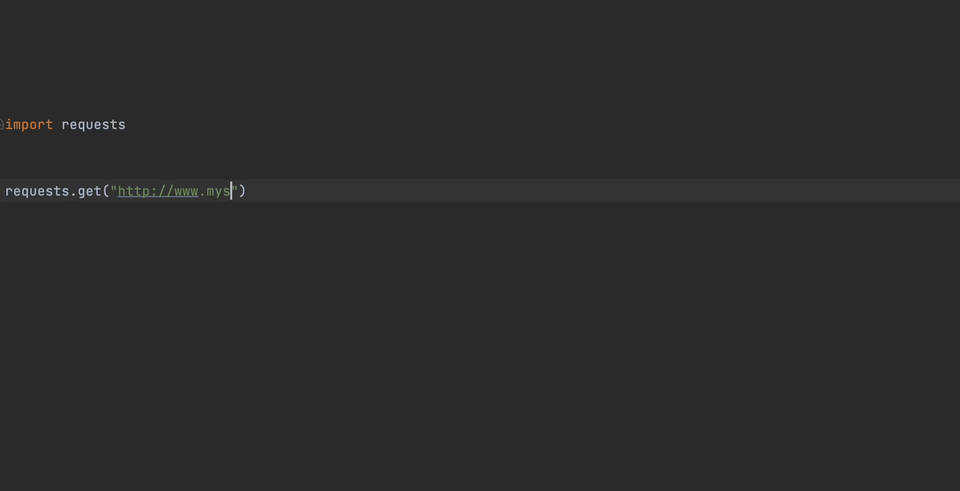
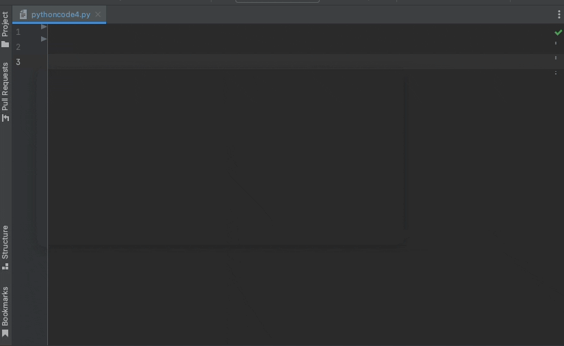
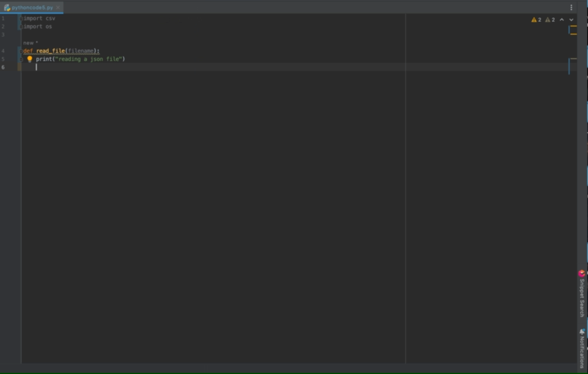

[Datadog acquired Codiga](https://www.codiga.io/blog/codiga-joins-datadog/). This repository is no longer active.


# Codiga for Jetbrains

Codiga is a static code analyzer on steroids.

Codiga is compatible with all JetBrains products: IntelliJ, AppCode, PHPStorm, DataDrip, GoLand, RubyMine, PyCharm,
CLion (and many more).



## Installation

Codiga is available on the [Jetbrains marketplace](https://plugins.jetbrains.com/plugin/17969-codiga)
and you can install it directly within any Jetbrains product (IntelliJ, PHPStorm, PYCharm, etc).


## Static Code Analysis

The static code analysis works for Python in Beta.

With Codiga, you can:

- Use Code Analysis rules from the [Codiga Hub](https://app.codiga.io/hub/rulesets)
- Create your own Code Analysis rules

### Getting Started


### Automatically

At the root of your project, invoke the following command

```bash
npx @codiga/cli@latest ruleset-add
```

**Note**: you must have `npx` installed (available with `npm`)

### Manually
Visit the [Codiga Hub](https://app.codiga.io/hub/rulesets) and select the rulesets to use for your project.

Then, create a `codiga.yml` **at the root of your project** with the list of rulesets you want to use.

Example of `codiga.yml` for Python:

```yaml
rulesets:
  - python-security
  - python-best-practices
```

## Code Snippets

### Quick Start

Open a file, make a one-line comment to see all suggestions from the Codiga API.

By default, Codiga searches all public snippet. If you want Codiga to also
look for your own snippets, add your API keys (see configuration below).

### Using shortcuts in the IDE

Install the extension and type `.` in your IDE to list all available snippets for your current environment (language,
file, libraries).

Accept a snippet using either Enter ↩ or Tab ↹. Go through the snippet variables using the Tab key.



### Snippet Search

Use the Codiga Snippets panel on the right to find code snippets that match your environment.

Syntax highlighting is available for Python and Java snippets.



### Semantic Search

Press CTRL + ALT + C (or choose the menu option "Tools" → "Coding Assistant") to launch a request
to Codiga and find snippets based on your keywords.


### List all shortcuts

Press CTRL + ALT + S (or choose the menu option "Tools" → "Shortcuts") to list
all keywords for your environment.


### Creating and sharing snippets


1. Select the code in your editor
2. Right click on `Create Codiga Snippet`

## Connecting your Codiga Account

You can connect your Codiga account and benefit from all the Codiga features:

1. use the code snippets and cookbooks you define and subscribe to
2. use all your code analysis preferences on Codiga

In order to link your Codiga account, you need to add your API token to your preferences.
First, go on our application and generate an API token as shown below.


Then, enter your API token in the Jetbrains plugin configuration, as shown below.


Once the token is added, click on "Apply" and then "Test API connection".

# Support

You can use the current [issue tracker](https://github.com/codiga/jetbrains-plugin/issues)
or report the issue on
our [Slack channel](https://join.slack.com/t/codigahq/shared_invite/zt-9hvmfwie-9BUVFwZDwvpIGlkHv2mzYQ).

# Implementation Details

## Dependencies

* [apollo-android](https://github.com/apollographql/apollo-android)
  to access the [Code Inspector GraphQL API](https://doc.codiga.io/docs/api/)

## License

This project is under the GPL-3. See the LICENSE file for more information.

## Contact

To report a bug, submit an issue directly on
the [GitHub issue tracker](https://github.com/codiga/jetbrains-plugin/issues).
