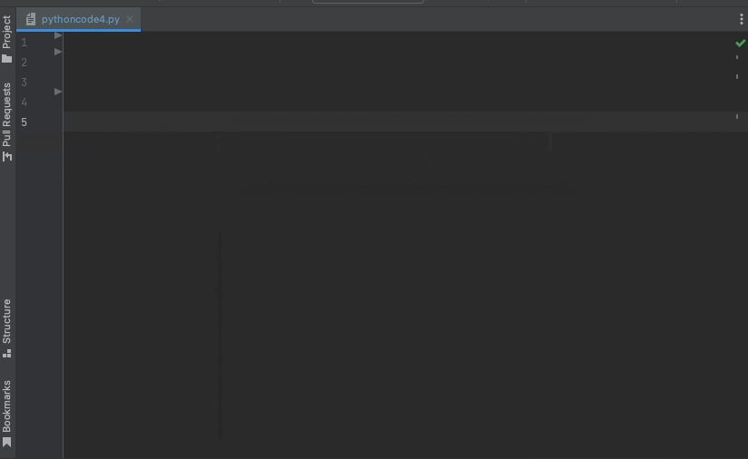

# Codiga Plugin for Jetbrains products

This is the source code for the Jetbrains plugin for Codiga.

Codiga provides two main functionalities:

 - **Coding Assistant**: import reusable code blocks based on your context
 - **Code Analysis**: no-configuration code analysis for 12+ languages

It is available on the [Jetbrains marketplace](https://plugins.jetbrains.com/plugin/17969-codiga) 
and you can install it directly within any Jetbrains product (IntelliJ, PHPStorm, PYCharm, etc).

## Quick Start

Install the extension and type `.` in your IDE to list all available snippets for your current environment (language, file, libraries).

Accept a snippet using either Enter ↩ or Tab ↹. Go through the snippet variables using the Tab key.

## Semantic Search

Press CTRL + ALT + C (or choose the menu option "Tools" → "Coding Assistant") to launch a request 
to Codiga and find snippets based on your keywords.

## List all shortcuts

Press CTRL + ALT + S (or choose the menu option "Tools" → "Shortcuts") to list
all keywords for your environment.

## Creating and sharing snippets

1. Select the code in your editor
2. Right click on "Create Codiga Recipe"

## Installation

Go to the plugins section of your Jetbrains product and search for "Codiga" on the marketplace.

### Code Analysis

Codiga analyzes your code and surfaces any issue. It works for 12+ languages. Codiga directly annotates all issues in your IDE. 
You can select to learn more about each violation, see them on Code Inspector or just ignore them.

Enable or disable the Code Analysis in the project preferences as shown below.

## Connecting your Codiga Account

You can connect your Codiga account and benefit from all the Codiga features: 

 1. use the code recipes and cookbooks you define and subscribe to
 2. use all your code analysis preferences on Codiga

In order to link your Codiga account, you need to add your API token to your preferences.
First, go on our application and generate an API token as shown below.

Then, enter your API token in the Jetbrains plugin configuration, as shown below.

Once the token is added, click on "Apply" and then "Test API connection".

# Implementation Details

## Dependencies

 * [apollo-android](https://github.com/apollographql/apollo-android) 
   to access the [Code Inspector GraphQL API](https://doc.codiga.io/docs/api/)

## License

This project is under the GPL-3. See the LICENSE file for more information.

## Contact

To report a bug, submit an issue directly on the [GitHub issue tracker](https://github.com/codiga/jetbrains-plugin/issues).
